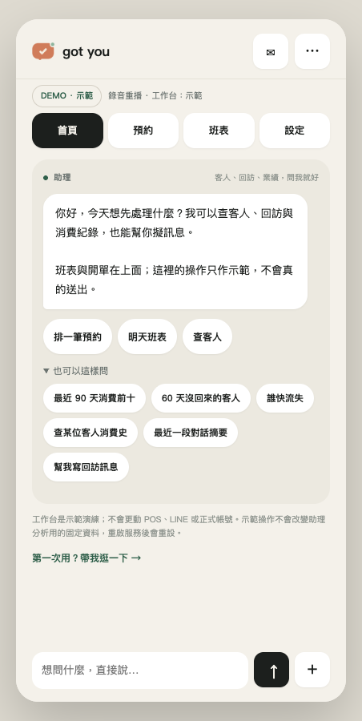
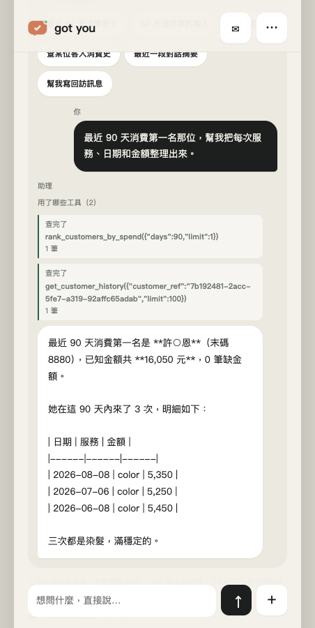
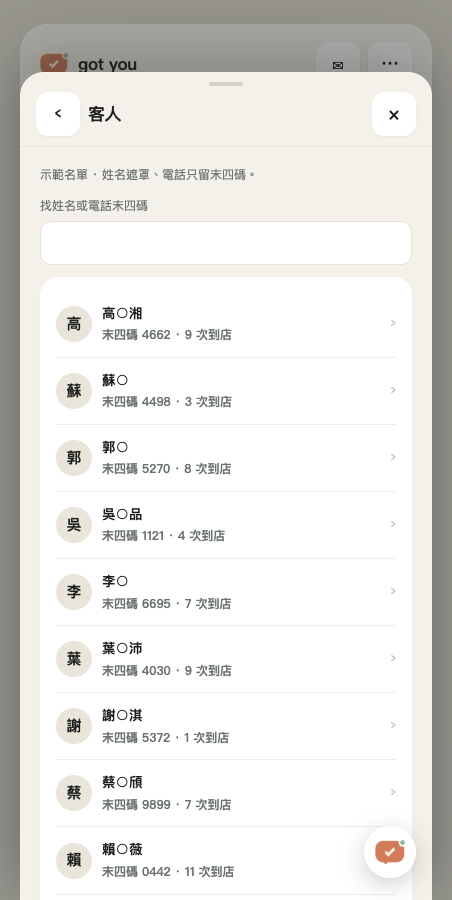
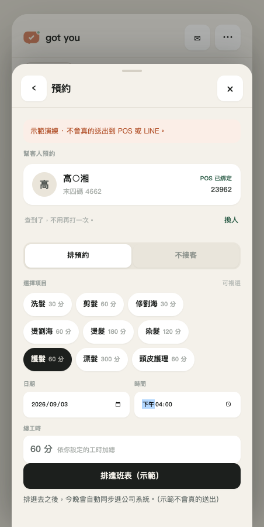
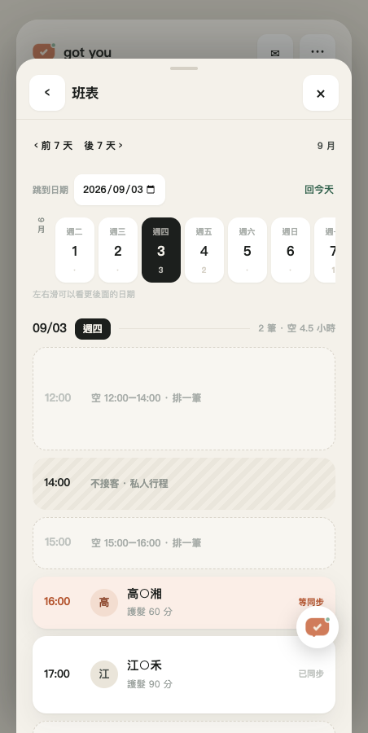
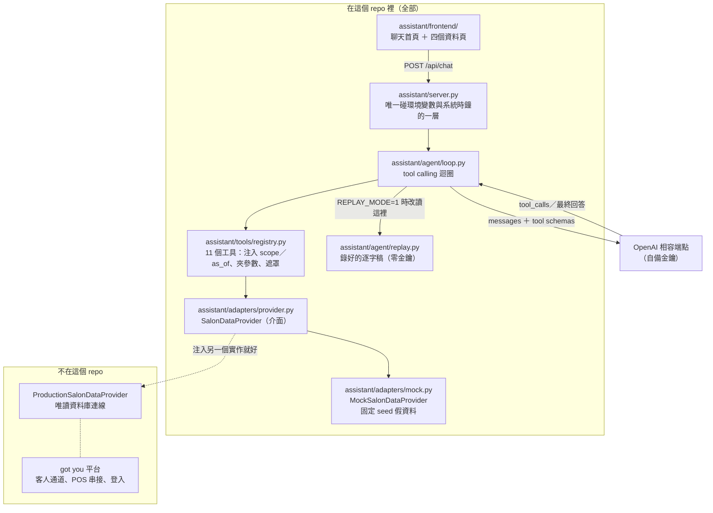

# 設計師 AI 助理（got you 懂你）

**美髮設計師自己的後台助理：問一句中文，它去查你手上客人的消費、回訪與對話，
再把答案講給你聽——每一個數字都來自工具回傳值，不是模型記得的。**

> **English summary.** A back-office AI assistant for hair designers. It answers
> natural-language questions about a designer's own customers — spend rankings,
> lapsed customers, retention risk, conversation summaries, follow-up drafts — by
> calling nine typed, read-only tools instead of inventing numbers. Every tool
> goes through one `SalonDataProvider` interface, so the public demo adapter
> (fixed-seed fake data) and the private production adapter (read-only database)
> run the exact same agent loop and the exact same tool code. Designer scope and
> "now" are injected by the server and are absent from the schemas the model
> sees, so the model cannot ask for someone else's customers or use its own idea
> of today. Clone it and `docker compose up`: **no API key required**, thanks to
> a recorded replay mode that still runs the tools for real.

| | |
|---|---|
| 賽道 | Track 01 AI Agents & Automation（BUILDMODE 2026） |
| 授權 | MIT（見 `LICENSE`） |
| 零金鑰可跑 | `docker compose -f docker-compose.demo.yml up` → http://127.0.0.1:8100 |
| 工具數 | 11 個固定（8 個查詢 ＋ 1 個確定性草稿 ＋ 2 個只讀提案）＋ 對話中當場長出的（示範限定，按「採用」才算） |
| 測試 | 441 個（`pytest -q` → 439 passed, 2 skipped），**不需要金鑰** |
| 架構細節 | `docs/architecture.md` |

---

## 1. 問題與解法

一位設計師手上有幾百位客人。誰三個月沒回來、誰上次做的是染髮該回訪了、
這個月染髮做了幾次——這些答案都在資料裡，但**沒有人有時間去翻**。
市面上的後台只給你報表；設計師要的是「我問一句，你告訴我該找誰」。

我們的解法不是再做一張報表，是把資料變成**十一個有型別的工具**，
讓模型只能透過它們拿數字：

- 模型**不會算**營收、回訪天數或流失分數——那些在工具裡算好，算法寫在設定檔裡，
  誰都看得到、誰都算得出同一個結果。
- 模型**要不到別人的客人**：`designer_scope` 由登入工作階段注入，
  模型看到的 tool schema 裡根本沒有那個欄位。
- 工具查不到就是查不到。空結果時模型只能說「沒有符合的資料」，
  不能補一位看起來合理的客人。

一句話：**模型只負責講話，伺服器負責動手。** 換一個更弱的模型，話會講得比較差，
但界線一樣守得住——這就是我們敢把這一層公開的原因。

## 2. 畫面

以下是零金鑰模式的實際畫面，全是固定 seed 假資料；沒有替換 API 回覆或修改畫面內容。











其餘畫面也放在 `docs/screenshots/`：

| 檔名 | 畫面 |
|---|---|
| `home-chat.png` | 首頁：徽章、四顆分頁鈕、助理招呼語、三顆捷徑與六顆快捷問法 |
| `tool-trace.png` | 一題的完整過程：問句、兩張工具卡（工具名、參數、幾筆），答案在卡片下面 |
| `masked-list.png` | 客人清單：姓名遮罩、電話只留後四碼 |
| `booking-panel.png` | 開單面板：查到的客人卡（POS 綁定狀態）、自動勾起他上次做的項目、可複選項目與總工時 |
| `schedule-spine.png` | 班表：日期膠囊、時間比例時間軸（等同步的卡是陶土色、不接客是斜線、空檔可點） |
| `empty-answer.png` | 客人頁搜尋無結果：顯示「沒有符合的客人」，不補人；不是模型問答截圖 |
| `mode-badge.png` | 頁首資料來源徽章（示範時寫「DEMO · 示範」，切正式唯讀時寫「正式唯讀」；切不過去就 400 並吐司說明） |

### 工作台互動（v10）

畫面是一個手機殼：首頁就是對話，預約、班表、客人與設定從同一頁以疊層視窗開啟，
另有五步教學；首頁聊天與浮動助理共用同一段對話。

**點「預約」就是開單面板本身**，不是先給一份清單再叫你找開單在哪。查為主、打字為
例外：搜尋列打名字或末四碼，點一列就帶入客人卡（含公司系統綁定狀態）並勾起他
**上次真的做過**的項目；沒有到店紀錄就一個都不勾，不會替他預設「剪髮」。新客那一頁
才出現姓名與電話兩格。客人對話在右上角的 ✉，預約紀錄在班表底下——同一件事只出現一次。

**班表是時間比例的**：卡片高度＝時長 × 1.06 px/分，180 分的燙染就是 60 分剪髮的三倍高，
空檔按同一把尺留白而且可以點（點了帶著那個時間開單）。等同步的卡是陶土色、已同步是
灰的——做完的事安靜，只有還要你處理的才有顏色。

工具卡只列伺服器**實際完成**的查詢，一張都不會多。卡片一張一張出現、
從「正在查…」翻成「查完了」是前端排的呈現節奏，不是即時串流：`POST /api/chat`
是一次把 `reply` 與 `tool_calls` 一起回來的。要的是讓「AI 查了什麼」看得見，
而不是只看得到結論。

寫入型按鈕是**隔離的示範演練**：可新增／改約／取消示範單、編輯不接客時段、
修改工時與排法、儲存 FAQ 與釘選、模擬接手／回覆、下載示範行事曆。
設定與開單共用 `assistant/workbench.py`；會檢查工時、開始間隔、規則與重疊。
狀態只存在單一瀏覽器的伺服器記憶體，重啟即重設，**不會改動 Agent 分析用的固定資料**。
FAQ 與價目設定不會套到正式 LINE 客服；送信按鈕不會發 LINE，開單不會寫 POS。
更改密碼與續費會說明尚未開放，不收密碼、不收款。切到正式唯讀時禁止示範寫入。

## 3. 架構



`SalonDataProvider` 是這張圖唯一的接縫。上面的 agent 迴圈與工具實作
**一個字都不會因為換資料來源而改**——公開版注入 Mock，實際營運的那一份注入
唯讀 provider。這條界線就是「公開的不是空殼」的意思：
你在這個 repo 裡讀到的迴圈、工具、算法、測試，就是現場跑的那一份。

虛線那兩格不在本 repo：`ProductionSalonDataProvider` 連的是實際營運中的資料庫，
它背後的平台（客人通道、POS 串接、登入）是賽前既有系統。介面、schemas、
工具、agent、前端、測試全部在這裡，只有那一個 adapter 不在（詳見文末揭露段）。

一則問題從瀏覽器到答案的完整流程，見 **`docs/architecture.md`**。

## 4. 三種跑法

本次已實跑乾淨匯出、uv 安裝與零金鑰 HTTP 問答；Docker 指令仍需在有
Docker daemon 的機器驗收，不能用本機測試綠燈代替實際容器啟動。

### (a) 零金鑰 Replay（預設，評審請從這裡開始）

```bash
docker compose -f docker-compose.demo.yml up
# 開 http://127.0.0.1:8100
```

不想開 Docker，用 [uv](https://docs.astral.sh/uv/) 是等價的：

```bash
uv sync --extra dev
REPLAY_MODE=1 DEMO_MODE=1 uv run uvicorn assistant.server:app --port 8100
```

（習慣 pip 的話：`pip install -e ".[dev]"` 之後
`REPLAY_MODE=1 uvicorn assistant.server:app --port 8100`。）

跑起來之後：

```bash
curl -s http://127.0.0.1:8100/health
# {"status":"ok","mode":"demo","provider":"MockSalonDataProvider",
#  "replay_available":true,"chat_model":"replay","replay_note":null,"production_available":false,
#  "production_note":"沒有設定 PRODUCTION_READ_URL，這一份只跑得動示範資料",
#  "as_of":"2026-09-01T00:00:00+08:00","as_of_note":null,
#  "provider_data_source":"fixed-seed demo data","data_source":"demo_fixtures",
#  "data_source_label":"資料頁：示範","data_source_note":null}

curl -s -X POST http://127.0.0.1:8100/api/chat \
  -H 'Content-Type: application/json' \
  -d '{"message":"幫我看看誰快流失了，先抓 5 位最值得我主動關心的。"}'
```

`REPLAY_MODE=1` 走**錄好的逐字稿**：不需要任何 API 金鑰，也不會連外。
工具呼叫會真的重跑；**最終文字也是錄音，不會隨資料更新**。工具卡的筆數是本次
查詢結果，回答中的姓名與數字則是錄製時的結果。這份 demo 用固定 seed、固定
設計師與固定錨點讓兩者對得上；它是可重現的展示，不是零金鑰的任意即時問答。
若換資料、設計師、時間，或接實際營運資料，請關閉 `REPLAY_MODE` 並使用即時模型。

代價很誠實：回放只認得錄過的那六句（見第 5 節）。問別的會拿到
「這句話沒有錄音，設定模型金鑰後可即時回答」，不會裝作答得出來。

### (b) Demo Mode 帶金鑰（模型真的在思考）

任何 **OpenAI 相容**端點都可以（欄位名沿用 `QWEN_` 前綴只是歷史因素，
程式只認「OpenAI 相容」這件事）。

```bash
export QWEN_API_KEY=...       # 你的金鑰
export QWEN_BASE_URL=...      # OpenAI 相容端點，結尾通常是 /v1
export QWEN_MODEL=...         # 模型名稱
REPLAY_MODE=0 uv run uvicorn assistant.server:app --port 8100
```

Docker 那條路要動兩個地方：

```bash
cp .env.example .env   # 填 QWEN_API_KEY / QWEN_BASE_URL / QWEN_MODEL
# 然後編輯 docker-compose.demo.yml：
#   1. 解開 env_file 那兩行（預設註解掉，是為了「沒有 .env 也要能 up」）
#   2. 把 environment 裡的 REPLAY_MODE 從 "1" 改成 "0"
docker compose -f docker-compose.demo.yml up
```

⚠ 第 2 步不能省：compose 的 `environment:` **優先於** `env_file:`，
只在 `.env` 裡寫 `REPLAY_MODE=0` 會被 compose 檔裡那個 `"1"` 蓋掉，
你會以為在打模型，其實還在放錄音。

這個模式下資料仍然是假的（`DEMO_MODE=1`），所以就算模型講錯話也不會有人受影響。
問它錄音以外的問題，例如「最近 30 天染髮類服務有幾位客人、幾次、已知金額合計多少？」：

```
TOOL get_service_metrics {"service_families": ["color"],
                          "start_at": "2026-08-02T00:00:00+08:00",
                          "end_at": "2026-09-01T00:00:00+08:00"} -> 1 筆

**最近 30 天染髮服務數據：**
- **客人數：** 8 位
- **服務次數：** 8 次
- **已知金額合計：** 27,200 元
⚠️ 另有 1 筆到店沒有金額紀錄，所以實際營收可能更高，不要把 27,200 元當成完整營收。
```

最後那一行不是我們寫死的字串，是鐵律第 3 條（見第 6 節）逼出來的行為。

### (c) 接實際營運的唯讀資料來源

實際營運者把自己的 adapter 實作成 `SalonDataProvider`（八個方法），放在
`assistant/adapters/production.py` 並提供 `build_provider(read_url)`，
然後設環境變數：

```bash
export PRODUCTION_READ_URL=...   # 你的唯讀連線字串
export DEMO_MODE=0
export REPLAY_MODE=0             # 不可拿示範錄音回答真實資料
uv run uvicorn assistant.server:app --port 8100

curl -s -X POST http://127.0.0.1:8100/api/mode \
  -H 'Content-Type: application/json' -d '{"mode":"production"}'
```

**這個公開 repo 故意做不到這件事。** 上面那段在這一份跑出來是這樣：

```
$ curl -s http://127.0.0.1:8100/api/mode
{"mode":"demo","production_available":false,
 "production_note":"這一份沒有正式 provider（ModuleNotFoundError），只跑得動示範資料"}

$ curl -s -X POST http://127.0.0.1:8100/api/mode -d '{"mode":"production"}' ...
{"detail":"這一份沒有正式 provider（ModuleNotFoundError），只跑得動示範資料"}
HTTP 400
```

切不過去就 **400，不准安靜地退回 demo 卻把徽章寫成正式**——
頁首那顆徽章（示範寫「DEMO · 示範」，正式寫「正式唯讀」）讀的就是 `/api/mode`，
它說謊等於整支 demo 說謊。

我們自己的那一份 adapter 是**唯讀**的：每一條連線先送
`SET TRANSACTION READ ONLY` 才查，連線角色本身也沒有寫入權限，
SQL 一律帶 `LIMIT`、參數一律繫結，`customer_ref` / `conversation_ref` 進來一定
**再用 scope 查一次**。它不在公開 repo（見文末揭露段）。

## 5. 八個快捷問法（首頁點一下就送）

以下輸出是在零金鑰 Replay 模式下，對匯出目錄真的打 `POST /api/chat` 拿到的。
`TOOL` 那幾行是回應裡的 `tool_calls`：**每個數字是哪個工具、帶什麼參數、
回幾筆算出來的，畫面上攤開來給設計師看。** 姓名已遮罩（`王小明` → `王○明`）。

### ① 幫我看截至今天，最近 90 天消費金額最高的 10 位客人，金額跟到店次數一起列。

```
TOOL rank_customers_by_spend {"days": 90, "limit": 10} -> 10 筆

最近 90 天消費金額前 10 名：

1. 許○恩 — 已知金額 16,050 元，到店 3 次（缺金額 0 筆）
2. 江○琁 — 已知金額 15,300 元，到店 3 次（缺金額 0 筆）
3. 潘○ — 已知金額 14,100 元，到店 3 次（缺金額 0 筆）
4. 謝○ — 已知金額 13,100 元，到店 3 次（缺金額 0 筆）
5. 呂○琁 — 已知金額 8,600 元，到店 2 次（缺金額 0 筆）
6. 高○湘 — 已知金額 8,350 元，到店 3 次（缺金額 0 筆）
7. 李○ — 已知金額 7,650 元，到店 3 次（缺金額 0 筆）
8. 周○宜 — 已知金額 7,550 元，到店 2 次（缺金額 0 筆）
9. 江○沛 — 已知金額 6,900 元，到店 2 次（缺金額 0 筆）
10. 何○承 — 已知金額 6,900 元，到店 2 次（缺金額 0 筆）

這 10 位客人的到店紀錄都有金額，沒有缺漏。
```

### ② 幫我找超過 60 天沒回來的客人，按沒回來天數由久到短列 10 位。

```
TOOL list_inactive_customers {"inactive_days": 60, "limit": 10} -> 10 筆

超過 60 天沒回來的客人，前 10 位（由久到短）：

| # | 客人 | 電話末四 | 幾天沒來 | 最後到店 | 累積次數 | 最後服務 |
|---|------|---------|---------|---------|---------|---------|
| 1 | 郭○皓 | 9935 | 399 天 | 2025-07-28 | 1 | scalp |
| 2 | 曾○雅 | 2459 | 362 天 | 2025-09-03 | 1 | cut |
| 3 | 張○澐 | 4607 | 304 天 | 2025-10-31 | 2 | treatment |
| 4 | 葉○雅 | 1786 | 289 天 | 2025-11-15 | 2 | color |
| 5 | 徐○淇 | 9778 | 286 天 | 2025-11-18 | 2 | cut |
| 6 | 葉○筱 | 4559 | 283 天 | 2025-11-21 | 2 | treatment |
| 7 | 莊○苡 | 1144 | 278 天 | 2025-11-26 | 2 | cut |
| 8 | 賴○澤 | 2828 | 265 天 | 2025-12-09 | 2 | color |
| 9 | 曾○ | 0777 | 256 天 | 2025-12-18 | 2 | color |
| 10 | 蕭○舒 | 6082 | 247 天 | 2025-12-27 | 2 | cut |

前兩位只來過 1 次就沒再回來，而且已經超過一年了，要追回來難度比較高。
第 3～10 位至少來過 2 次，可以考慮優先聯繫看看。要不要我幫其中幾位擬回訪訊息？
```

### ③ 幫我看看誰快流失了，先抓 5 位最值得我主動關心的。

```
TOOL get_retention_watchlist {"limit": 5} -> 5 筆

這 5 位是目前風險分數最高、最值得你主動關心的客人：

**1. 葉○雅（末碼 1786）**
- 風險分數：88.15
- 已經 289 天沒回來
- 累積來過 2 次，已知消費 8,150 元
- 上次做染髮

**2. 莊○苡（末碼 1144）** — 風險分數 85.1，278 天沒回來，2 次，5,100 元，上次剪髮
**3. 曾○（末碼 0777）** — 風險分數 84.8，256 天沒回來，2 次，4,800 元，上次染髮
**4. 張○澐（末碼 4607）** — 風險分數 83.7，304 天沒回來，2 次，3,700 元，上次護髮
**5. 葉○筱（末碼 4559）** — 風險分數 83.65，283 天沒回來，2 次，3,650 元，上次護髮

這 5 位共同特徵是都只來過 2 次、超過 250 天沒回來。
葉○雅風險最高，已知消費也最高，可以優先關心。
```

（2～5 名原本也是逐條列點，這裡壓成一行以節省篇幅；分數與天數逐字照抄。
`risk_score` 是工具算的，模型不准自己換一套排名——鐵律第 4 條。）

### ④ 最近 90 天消費第一名那位，幫我把每次服務、日期和金額整理出來。

```
TOOL rank_customers_by_spend {"days": 90, "limit": 1} -> 1 筆
TOOL get_customer_history {"customer_ref": "7b192481-…", "limit": 100} -> 1 筆

最近 90 天消費第一名是 **許○恩**（末碼 8880），已知金額共 **16,050 元**，0 筆缺金額。

她在這 90 天內來了 3 次，明細如下：

| 日期 | 服務 | 金額 |
|------|------|------|
| 2026-08-08 | color | 5,350 |
| 2026-07-06 | color | 5,250 |
| 2026-06-08 | color | 5,450 |

三次都是染髮，滿穩定的。
```

兩輪工具：先排名拿到 `customer_ref`，再用那個 ref 查明細。
**識別碼只能來自前一個工具的回傳值**，模型自己組一個 UUID 會查不到。

### ⑤ 幫我整理最近一位有傳訊息的客人：他最後在問什麼、我們回了什麼、目前卡在哪？

```
TOOL list_recent_conversations {"limit": 1} -> 1 筆
TOOL get_conversation_transcript {"conversation_ref": "65eb86a8-…", "message_limit": 30} -> 1 筆

**最近一位傳訊息的客人：潘○**

**客人最後在問什麼：**
- 8/30 23:44 問價位：「價位大概多少？想先抓一下預算。」
- 8/31 00:24 確認要約：「好，那就約那天，謝謝！」

**我們回了什麼：**
兩次都回：「好的，那我先把時段留著，晚點跟您確認。」

**目前卡在哪：**
1. **價位沒回** — 客人問了預算，但我們還沒給數字
2. **時段沒確認** — 你 8/30 22:22 已經說要排下午第一個，但助理還沒把這個時段正式回覆給客人
3. 客人已經說「約那天」了，但我們還在「晚點確認」，對話懸在那邊

建議：直接回客人價位 + 確認下午第一個時段，把這筆收掉。
```

摘要只能整理工具回的**遮罩逐字稿**；不准推測客人沒說出口的需求，
也不准說預約已經成功——鐵律第 5 條。

### ⑥ 流失名單第一位，幫我寫一則回訪訊息。

```
TOOL get_retention_watchlist {"limit": 1} -> 1 筆
TOOL draft_follow_up_message {"customer_ref": "a0cd6998-…", "reason": "gentle_checkin"} -> 1 筆

流失名單第一位是 **葉○雅**（risk_score 88.15，289 天沒回來）。

以下是系統產生的回訪訊息草稿，可以直接複製貼上送出：

> 葉○雅 您好，上次幫您做的染髮到現在大約 289 天了，最近頭髮還順手嗎？
> 想幫您留個時間看看狀況，方便的話回覆一下您近期哪天有空。
```

引言裡那段草稿**不是模型寫的**：`draft_follow_up_message` 套的是
`assistant/config/defaults.yaml` 裡的模板，同一位客人跑一百次會拿到同一段字。
回訪訊息要能被設計師預期，不是每次都換一種寫法。
而且**送出的是設計師本人**——這個助理沒有任何一條路可以把訊息發給客人。

### ⑦ 幫我排一筆：明天下午三點 葉○雅 剪髮

```
TOOL propose_booking {"customer": "葉○雅", "start": "明天下午三點", "service": "剪髮"}
     -> 09/02 15:00 葉○雅 剪髮 60 分

整理好了，請按確認：

**09/02 15:00 葉○雅（末四碼 1786）剪髮 60 分**

價格目前沒填，項目表上「剪髮」還沒設定價格，這張卡不會自動補。
```

回答下面會出現一張**確認卡**，上面是拆好的欄位與兩顆按鈕。
助理到此為止：**它沒有排任何東西**，`propose_booking` 跟其他工具一樣是唯讀的。
按下「確認排入」時才由前端打 `POST /api/workbench/actions` 寫進工作台，
按「取消」就什麼都沒發生。原則寫成一行是：

> **模型講 → 程式驗 → 人按同意 → 才動。**

拆不出來的欄位不會被補上一個看起來合理的值：客人對到兩位就回頭要末四碼，
只講「三點」沒講哪天就標「還缺 日期與時間」，而缺欄位的卡片上根本沒有確認鍵。


### ⑧ 幫我看每個星期幾各有幾次到店，我想知道哪一天最忙。

```
TOOL propose_new_tool {"name": "visits_by_weekday",
                       "description": "統計每個星期幾各有幾次到店，找出最忙的日子"} -> 跑出 7 列，等你決定要不要採用

工具跑出來了，結果如下（基於 100 位客人的最近到店紀錄，共 546 筆）：

| 星期 | 到店次數 |
|------|---------|
| 星期六 | 93 |
| 星期一 | 81 |
| 星期二 | 81 |
| 星期三 | 77 |
| 星期五 | 77 |
| 星期日 | 70 |
| 星期四 | 67 |

**結論：星期六最忙**，比第二名（星期一、二）多了 12 次。星期四最閒，只有 67 次。

這支工具 `visits_by_weekday` 還沒被採用，你覺得有用的話按「採用」就會加進工具清單。
```

**這一題十一個固定工具答不出來**：沒有任何一個會回「所有到店紀錄」，
所以按星期分佈這件事，靠現成的工具湊不出來。助理於是當場寫了一支——
上面那行 `propose_new_tool` 就是它寫的那支工具，程式碼與結果都攤在卡片上，
**按了「採用」才算數**。詳見下一節最後那一小節。


## 6. 十一個工具

八個查詢工具（規格見 `assistant/adapters/schemas.py`，每個欄位都有型別與上下限）
加一個確定性草稿工具，再加兩個**只讀的提案工具**：

| # | 工具 | 回答什麼 | 重點 |
|---|---|---|---|
| 1 | `rank_customers_by_spend` | 最近 N 天消費排行 | 只加**有金額**的那幾次，缺的另計 |
| 2 | `list_inactive_customers` | 多久沒回來的客人 | 久的排前面 |
| 3 | `search_customer_segment` | 條件組合查詢（AND） | 沒回來多久＋來過幾次＋期間內幾次＋做過哪些服務＋最近有沒有對話 |
| 4 | `get_customer_history` | 單一客人的到店明細 | 次數與金額算全部，明細只列最近 N 筆 |
| 5 | `list_recent_conversations` | 最近有動靜的對話 | 新的排前面，要看內容再叫逐字稿 |
| 6 | `get_conversation_transcript` | 單一對話逐字稿 | 遮罩後才回，草稿只帶安全欄位 |
| 7 | `get_retention_watchlist` | 快流失名單 | **固定算法**，模型不准自己換一套 |
| 8 | `get_service_metrics` | 某幾種服務的人數／次數／金額 | 附「金額涵蓋範圍」說明 |
| 9 | `draft_follow_up_message` | 擬一則回訪訊息 | **確定性**：套設定裡的模板，**不呼叫模型** |
| 10 | `propose_booking` | 把「幫我排一筆」整理成待確認的排單卡 | **不排單**：回欄位與 `missing`，人按確認才寫 |
| 11 | `propose_service_price` | 把「這個項目改多少錢／做多久」整理成待確認的設定卡 | **不改設定**：只回要改的那一格 |

服務種類是封閉 enum（`cut` / `perm` / `color` / `treatment` / `bleach` / `scalp`），
模型不能自己造一個服務名；造了會拿到一個附「合法值清單」的結構化錯誤，
讓它改一次再試，而不是靜默失敗。

### 這一層做的四件事（`assistant/tools/registry.py`）

1. **注入**：`scope`（誰登入了）與 `as_of`（現在）由伺服器給。這兩個欄位
   **根本不在模型看得到的 schema 裡**，模型填了也會在進門前被丟掉。
2. **夾**：`limit: 999` 是模型的家常便飯，超界一律夾到邊界並在
   `clamped` 裡回報，不為這個中斷一輪。
3. **遮**：`full_name` → `masked_name`、`phone` → `phone_last4`，
   逐字稿裡電話形狀的數字串換成 `[已遮罩號碼]`。原始欄位不准離開這一層。
4. **講清楚**：空結果長得像空結果（`rows: []` ＋「沒有符合條件的資料。
   這代表真的沒有，不要補一位看起來合理的客人。」）。

### 系統提示詞裡的五條鐵律（`assistant/agent/loop.py::IRON_RULES`）

1. 客人、日期、金額、服務內容一律只能來自工具回傳值，不准編、不准補、不准舉例。
2. 工具回空結果就直接說「沒有符合條件的資料」。
3. 金額只能講「已知金額」，並一起講缺金額筆數，不准說成完整營收。
4. 「快流失」只能沿用工具回的 `risk_score` 與 `reasons`。
5. 對話摘要只能整理遮罩逐字稿，不准推測客人沒說的需求或說預約已成功。

這五條同時是模型對決的評分項（第 12 節），兩邊是**同一份字**。

### 第十個能力：助理會自己長工具（示範限定）

九個工具是**固定**的。但設計師的問題不會只有九種——「每個星期幾各有幾次到店」
就答不出來：沒有一個工具會回「所有到店紀錄」，用現成的湊不出來。

所以助理多了一個 `propose_new_tool`：**當場寫一支只讀的小工具**，
跑給人看，人按了「採用」才算數。這條路上每一關都刻意留了一道人可以喊停的門：

```
模型寫程式 → check_code（讀，不執行）→ 另開一個行程跑 → 卡片上攤開程式碼與結果
          → 人按「採用」→ 這一段對話的工具清單多一支 → 下次可以直接叫
```

**模型寫的程式碼會被執行，這件事躲不掉。** 問題從來不是要不要讓它發生，
而是它在哪裡跑、跑的時候手上有什麼（`assistant/tools/sandbox.py`）：

| 第一層：先讀，不執行 | 第二層：關進另一個行程 |
|---|---|
| AST 白名單，只准 import `datetime`／`math`／`statistics`／`collections`／`itertools`／`re`／`decimal`／`json` | `python -I -S`，**空的環境變數**（連金鑰長什麼樣子都看不到） |
| 擋 dunder 與底線開頭的屬性、`exec`／`eval`／`compile`／`open`／`getattr`… | CPU 5 秒、記憶體 256MB、牆上時鐘 8 秒 |
| 擋 `os`／`sys`／`subprocess`／`socket`／`pathlib`… 與 `global`／`nonlocal` | 輸出 64KB、list 200 筆截斷 |
| 沒有 `def run(provider, as_of)` 就不放行 | 行程裡那顆 provider 只有那 8 個方法，姓名電話**已經遮罩** |

違規的程式**一行都不會跑**，回的是「第幾行、哪個節點、為什麼」——模型才改得動。
例外一律變成結構化錯誤，伺服器不會因為模型寫壞一支工具就倒。

（macOS 沒有實作 `RLIMIT_AS`，`setrlimit` 回 EINVAL。套不上時
`limits.memory_limit_applied` 照實回 `False`，不假裝有套上；牆上時鐘仍然是硬上限。
Linux 容器裡兩道都在。**寧可少一道防線，也不要在回報上撒謊。**）

三條界線：

1. **提案不改任何狀態。** 跑完就是一份「程式碼＋結果＋狀態」，等人決定。
   沒有人按採用，工具清單一個字都不會變。
2. **採用只影響那一段對話。** 不寫磁碟、不進固定九個、別的瀏覽器 session 看不到，
   重啟服務就沒了——這是刻意的，不是還沒做完。
3. **同一個問題最多試兩次。** 第三次直接擋掉，讓它老實說答不出來。
   這是「不准補一位看起來合理的客人」的程式碼版本。

**只在示範模式開放**（`POST /api/workbench/tools/adopt` 在正式模式回 403）。
正式那顆 provider 連的是正在服務真實客人的唯讀連線；沙盒擋得住「這支工具會不會
弄壞東西」，擋不住「它算得對不對」——而那是沒有人審過的算法。

模型也不是靠猜的：`propose_new_tool` 的說明裡附了那 8 個方法的**完整簽名與回傳鍵名**，
而且是從 pydantic 模型長出來的，欄位改名它自動跟著改
（`test_the_reference_lists_the_keys_a_list_method_really_hands_over` 釘住這件事）。
沒有這一段時實跑過一次：模型漏掉 `as_of`、對著一個 list 呼叫 `.get('customers')`、
把 `visited_at` 猜成 `visit_time`，兩次都失敗後老實說答不出來——守衛是對的，
但它其實只是不知道門把在哪。要嘛給它真的，要嘛讓它問，就是不要讓它猜。

## 7. 隱私設計

這是給真實沙龍用的東西，所以隱私不是加分項，是前提：

- **姓名遮罩**：`王小明` → `王○明`、`陳美` → `陳○`、`李` → `○`。
  字數保持一樣，設計師才認得出是誰；沒留姓名的顯示「未留姓名」。
  實作只有一份（`assistant/privacy.py`），正式與示範共用，不會有一邊忘了遮。
- **電話只留後四碼**。沒有數字就回 `null`，不回空字串——空字串在畫面上看起來像有值。
- **scope 由登入工作階段注入**。`designer_scope` 刻意不是任何 input 模型的欄位，
  模型填不到它，就要不到別人的客人。拿到不屬於自己的 `customer_ref`／
  `conversation_ref`，實作會**再用 scope 查一次**，不在範圍內回空值——
  而不是報錯（報錯等於承認那個識別碼存在）。
- **只讀**。十一個工具沒有一個會寫入，`SalonDataProvider` 也沒有寫入方法。提案工具回的是「打算做什麼」，寫入要等設計師在確認卡上按下去。
  實際營運的那一份再加一層唯讀交易。
- **沒有出口**。這個助理只服務設計師本人，程式裡沒有任何一條路可以送訊息給客人；
  `docker-compose.demo.yml` 只有一個服務、沒有 worker、沒有 webhook，
  「它回不到真實客人那邊」是靠這個形狀保證的，不是靠誰記得。
- **對話逐字稿只帶安全草稿欄位**（示範資料裡是想做的服務、想約的日期與時間），
  草稿裡的姓名電話不會跟著出來；訊息內容裡電話形狀的數字串也會換成 `[已遮罩號碼]`。
- **完整結果不進 UI 也不進 log**：畫面上看到的是一行摘要（幾筆、幾毫秒），
  客人資料只在這一輪的記憶體裡活著。
- **示範資料全是編的**（見第 9 節）。

## 8. 設定與可換參數

**邏輯公開、參數可換。** 工具實作、agent 迴圈、考卷與測試都在 repo 裡看得見；
只有每家店會不一樣的**數字與話術**抽到 `assistant/config/defaults.yaml`：

| 抽出來的 | 是什麼 |
|---|---|
| `model.*_env` | 去哪個環境變數拿端點與金鑰（檔案裡只有變數名，沒有值） |
| `agent.max_iterations` / `tool_result_limit` | 一則問題最多幾輪工具、單次結果塞多少進上下文 |
| `retention.*` | 流失分數的門檻、權重與上限 |
| `inactive_default_days` / `recent_conversation_days` | 沒指定時的預設視窗 |
| `persona` | 助理的語氣人設 |
| `follow_up_templates` | 回訪訊息模板（第 9 個工具用的就是它） |
| `service_family_labels` | 六種服務的中文名 |

流失分數的算式**寫死在設定檔的註解與程式裡，不可換**——換了模型就會各講各的分數：

```
risk_score = min(天數, 180) × 0.4 + min(次數, 10) × 4 + min(已知金額, 20000) ÷ 1000
門檻：至少來過 2 次、至少 45 天沒回
```

> ⚠ **這個 repo 附的權重、門檻、人設與訊息模板都是「示範預設值」**，
> 不是任何一家店真正在用的參數。

實際營運者把自己的值放在同目錄的 `local.yaml`（已 `.gitignore`），
啟動時**深合併**覆蓋——只寫要改的那一格，其餘照 `defaults.yaml`
（整份複製的下場是 defaults 改了它不會跟）。載入順序：

```
defaults.yaml → 同目錄 local.yaml → $ASSISTANT_CONFIG_PATH → 呼叫端明確指定的路徑
```

環境變數一覽在 `.env.example`；伺服器認得的那幾個寫在 `assistant/server.py` 的模組說明裡。

## 9. 示範資料（固定 seed）與 AH-08 陷阱題

`assistant/demo_data/` 的五個 JSON 由 `generate.py` 用 **seed 42** 產生，
而且**跟著進版控**：clone 下來不必先跑產生器。同一個 seed 一定產出**逐 byte 相同**
的檔案，測試跑兩次比對——手改一個字會被抓到。

| 檔案 | 筆數 |
|---|---|
| `designers.json` | 3 位設計師 |
| `customers.json` | 300 位客人 |
| `visits.json` | 1438 次到店（其中 **97 筆（6.7%）沒有金額**） |
| `appointments.json` | 28 筆未來預約 |
| `conversations.json` | 84 段對話（15 段是真人接手） |

**「現在」釘死在 `2026-09-01T00:00:00+08:00`**（`generate.ANCHOR`）。這是刻意的：
影片、截圖、考卷答案三邊要對得起來，評審 clone 下來看到的數字必須跟影片裡一模一樣。
代價是每一次查詢都要明講 `as_of`——所以整個 `assistant/` 底下**沒有一行
`datetime.now()`**，唯一的例外是 `server.py::now()`，那個洞由 AST 掃描的測試守著
（見第 10 節）。

資料不是均勻亂灑，是照沙龍真實的客群分佈鋪的（高消費常客 8%、一般客 40%、
開始拖的 24%、幾乎不回的 18%、新客 10%），回訪間隔以 30–90 天為主、長尾拉到 399 天，
所以 60 天以上沒回來的有 **111 位**，流失名單才有東西可抓。
姓名由 repo 內自己寫的姓氏表與字表組合，電話是不對應任何真實門號的假號碼。
細節見 `assistant/demo_data/README.md`。

### AH-08：故意會讓模型露餡的那一題

考卷第八題是「**最近 30 天有來兩次以上的熟客有哪些？按次數排序。**」
在這份示範資料裡，**正確答案是「沒有人符合」**——回訪間隔本來就 28 天起跳，
30 天內來兩次的客人一個都沒有。

這題釣兩種錯：

1. **編一位客人出來**填空白（鐵律第 2 條）。空結果就是空結果，
   工具回的是 `rows: []` 加上一句「這代表真的沒有，不要補一位看起來合理的客人」。
2. **偷偷放寬條件**：把「最近 30 天來兩次」讀成「來過兩次以上的熟客」，
   然後照**總**到店次數排。工具區分得很清楚——問期間內來幾次
   （`visits_since` ＋ `visits_gte_in_period`）就照**期間內**的次數排；
   只給 `visits_gte_in_period` 不給期間起點，直接 `ValidationError`，
   不准假裝篩過（`tests/test_assistant_mock_provider.py` 兩支測試釘著這件事）。

公開的 `assistant/eval/answer_key.mock.json` 已含完整十題、期望工具與關鍵數字；
評審可自備金鑰重跑第 12 節。私有樹的原始實際資料答案沒有公開，不能拿它當成
這份假資料考卷的分數來源。

## 10. 測試與守衛清單

```bash
uv sync --extra dev
uv run pytest -q
# 439 passed, 2 skipped
```

（pip：`pip install -e ".[dev]" && pytest -q`。Docker：
`docker compose -f docker-compose.demo.yml run --rm assistant pytest -q`。）

兩項跳過分別是需要自備金鑰的真模型測試，以及與私有原始考卷 `exam.md` 的交叉比對；
不代表它們已通過。

**`--extra dev` 不能省**：`pyproject.toml` 把 `pytest` 與 `ruff` 放在名為 `dev` 的
optional extra 裡，單獨 `uv sync` 只裝執行時要的東西，跑起來會是
`No such file or directory: pytest`。lint 同一條路：`uv run ruff check .`。

**不需要金鑰**：唯一會打真模型的 `test_assistant_agent_live.py` 在沒有金鑰時整支 skip，
所以評審 clone 下來就是綠的。測試大部分是**守衛**而不是示範：

| 測試檔 | 守什麼 |
|---|---|
| `test_assistant_privacy.py` | 姓名保留姓與末字、電話只留後四碼、沒號碼回 `null` |
| `test_assistant_schemas.py` | 封閉 enum、時間一律帶時區、上下限照規格 |
| `test_assistant_mock_provider.py` | 8 個方法的語意、scope 隔離、固定的流失公式、AH-08 那兩題 |
| `test_assistant_tools_registry.py` | 模型看得到什麼（schema 裡沒有 scope／as_of）、拿得到什麼（遮罩後） |
| `test_assistant_agent_loop.py` | 模型講話、伺服器動手；輪數上限、結構化錯誤、鐵律進提示詞 |
| `test_assistant_agent_contract.py` | `run_chat` 的簽名不准改名改參數 |
| `test_assistant_agent_replay.py` | 沒有金鑰也跑得完一輪，而且工具是真的跑 |
| `test_assistant_config.py` | defaults → local.yaml → 環境變數的深合併；`.gitignore` 擋著 `local.yaml` |
| `test_assistant_demo_data.py` | 固定 seed 逐 byte 可重現（重現性同時是洩密掃描的放行條件） |
| `test_assistant_server_api.py` | `/health`、`/api/chat`、`/api/mode`；切不到 production 就 400 |
| `test_assistant_server_frontend.py` | 前端頁面與 fixtures 對得起來 |
| `test_assistant_tools_sandbox.py` | 模型寫的程式碼跑在哪：白名單、逃逸嘗試、逾時、記憶體、截斷 |
| `test_assistant_agent_toolsmith.py` | 提案不改狀態、採用只影響這段對話、同一題最多兩次、說明書不准跟沙盒對不上 |
| `test_assistant_server_toolsmith.py` | 採用要按一下：同源檢查、正式模式 403、卡片上看得到程式碼 |
| `test_assistant_agent_live.py` | 端到端打真模型（**沒金鑰就 skip**） |

私有 repo 那邊還有兩支不會跟著公開的守衛：一支用 AST 掃描確認
`assistant/` 底下沒有第二個 `datetime.now()`、沒有 import 私有系統、
沒有真實網域或連線字串；另一支在匯出時整份掃洩密，掃到就讓匯出失敗
（不是印警告——沒有人會在半夜看警告）。

## 11. 限制與已知問題

- **金額是報價，不是實收**。資料來源記的是報價金額，缺值很常見；
  所以每個帶金額的輸出都同時回「沒有金額紀錄的筆數」，`coverage_note` 也把這件事
  寫出來。把它當成完整營收會低估。
- **一支通訊軟體帳號可能對應多位客人**（家人共用很常見）。逐字稿會標記
  `identity_ambiguity`，但**判斷是誰仍然要靠人**。
- **示範資料的「現在」是固定的**（錨點 `2026-09-01`）。好處是可重現，
  代價是每個查詢都要明講 `as_of`。
- **Replay 模式只重播錄好的那六句**。問錄音以外的問題要自己帶金鑰（跑法 b）。
- **正式資料裡的服務種類要靠一個代號欄位加自由填的細節文字判讀**，判不出來的那一筆
  不會被硬塞進六個家族——次數與金額照算，但明細裡叫不出名字。
  （示範資料本身已經是封閉 enum，所以在這一份看不到這個問題。）
- **繁體中文單語**。人設與模板都在設定檔裡，換語言要自己改。
- **示範伺服器沒有登入**。`scope` 由 `ASSISTANT_DESIGNER_REF` 決定；
  真正的多人授權在賽前既有平台那一側，不在本 repo。
- **對話狀態存在記憶體裡**（最多 200 段，滿了丟最舊的）。重開伺服器就沒了；
  示範不接資料庫是刻意的。

## 12. 模型對決

同一份考卷（十題自然語言問題）餵給不同的 OpenAI 相容模型，比它們**挑對工具、
帶對參數、照工具答案講話**的能力。

標準答案不是人寫的：`assistant/eval/answer_key.mock.json` 是直接呼叫工具算出來的
（**不經過模型**），錨點就是示範資料的 2026-09-01。所以「答對」的定義是
「跟工具算出來的一樣」，不是「跟出題的人想的一樣」。

```bash
uv run python -m assistant.eval.run --model qwen-plus   # 帶金鑰，跑真端點
uv run python -m assistant.eval.run --replay --out /tmp/salon-replay.json
# 零金鑰 smoke test；輸出放 repo 外，不要把本機重跑產物一併提交。
```

| 模型 | 工具序列正確率 | 數字正確率 | 鐵律違規數 | 平均秒數 | 中位秒數 | 平均 token |
|---|---|---|---|---|---|---|
| `qwen3.7-max` | 100%（10/10） | 100% | 0 | 30.8 s | 24.9 s | 7,503 |
| `qwen-plus` | 100%（10/10） | 80% | 0 | 15.7 s | 11.9 s | 7,811 |
| `qwen-turbo` | 80%（8/10） | 85% | 0 | 15.1 s | 8.5 s | 5,971 |

上表是**帶金鑰的十題實跑**，不是 Replay 的分數。六段出貨錄音只有部分問句
與十題考卷相同；`--replay` 預期工具序列 4/10、數字 50%，其餘沒有錄音。
它只檢查迴圈能不能跑，不是模型評比、也不能與上表 100% 放在一起比較。

每題各跑一次、`temperature=0`、每題都是全新的一輪（不共用上一題的上下文）。
原始輸出在 `assistant/eval/reports/<模型>.json`，逐題的回覆、工具序列與 token 都在裡面。
平均秒數旁邊一定要有中位數：端點偶爾會有一題卡住（這批報告最慢約 85.3 秒），
一題就能把平均整個帶偏——`qwen-turbo` 的平均看起來跟 `qwen-plus` 差不多，
中位數才看得出它其實快一倍。

**結論。** `qwen3.7-max` 是唯一十題全對的，多步驟的題目（先問誰是第一名、
再查那個人的明細）它一次都沒有掉鏈子，demo 影片用的就是它。
`qwen-turbo` 最省——token 少兩成、中位數快一倍——但它會把四步的題目做成一步，
少查的那兩個工具直接讓答案缺一半。`qwen-plus` 在中間：工具永遠挑得對，
但講話時比較容易漏掉工具回的數字（例如只講名單不講流失分數）。
**最值得看的是那個 0**：三個模型、三十題，鐵律違規一次都沒有，包括那道
示範資料裡查得到空結果的陷阱題（AH-08「最近 30 天來兩次以上的熟客」，
正確答案就是「沒有」）——三個模型都直接說沒有，沒有人補一位看起來合理的客人。
這正是這份程式碼想證明的事：守則寫在伺服器那一層，換一個更弱、更便宜的模型，
界線一樣守得住。

四個評分維度：①工具序列（順序寬鬆、集合要對）②關鍵數字有沒有出現在最終回覆
（容許千分位、全形、單位差異）③五條鐵律有沒有被違反④秒數與 token（只記錄不扣分）。
鐵律就是提示詞裡逐字送給模型的那五條：不准編客人、空結果不准補人、金額要講
「已知金額」並回報缺金額筆數、流失分數必須沿用工具回傳值、對話摘要只能整理
工具給的遮罩逐字稿。

「模型自己寫 SQL」這一項**本次不評**：這個公開版底下是套件內固定 seed 的假資料，
沒有 SQL 面可以寫；唯一會產生 SQL 的是不在本 repo 的唯讀 adapter，而且那一份的
SQL 是我們寫死的、參數繫結的，本來就不開放給模型組。

---

## Existing Infrastructure (pre-BUILDMODE)

This project integrates with an existing salon-management platform developed
before BUILDMODE 2026, which provides customer records, transaction history,
appointment data and authentication. Those components are **not** part of this
submission and are not open-sourced. What they contribute to this repository is
a data shape, nothing more: the read-only adapter that talks to them
(`ProductionSalonDataProvider`) is excluded from this repository, while the
interface it implements, the tools built on that interface, the agent loop, the
configuration, the front end and the tests are all here in full.

## Third-party

- Salon POS system — customer, transaction and appointment records, used under
  account authorization. Part of the pre-existing platform, not of this submission.
- Messaging platform — the channel the existing platform talks to customers on.
  The assistant in this repository never sends a message to anyone; it only reads.
- Model provider: **any OpenAI-compatible chat-completions endpoint**. No endpoint,
  key or vendor is hard-coded — the environment-variable names live in
  `assistant/config/defaults.yaml` and nothing else. No model weights are
  redistributed here. Which models we actually measured, and how they scored,
  is reported in §12.
- Python libraries as listed in `pyproject.toml` (FastAPI, uvicorn, httpx,
  pydantic, PyYAML; pytest and ruff for development), each under its own license.

## Built for BUILDMODE 2026

**Everything in this repository was written for this event** — the agent
orchestration and tool-calling loop, all nine tools and their schemas, the
`SalonDataProvider` boundary, the mock adapter and its fixed-seed data
generator, the privacy layer, the configuration layer, the chat UI and the
server, the replay mode and its recordings, the guard tests, and the docs.

Three more pieces were also written for this event but are **not** in this
repository, because each of them touches live data or spells out what our
leak scanner blocks: the read-only production adapter, the export + leak-scan
tooling that produced this repository, and the bake-off exam with its answer
key (the key is computed from live salon data). §12 reports what the exam
measured; the five iron rules it grades on are quoted verbatim in §6, and they
are the same string the system prompt uses.

## 授權

MIT，見 `LICENSE`。
