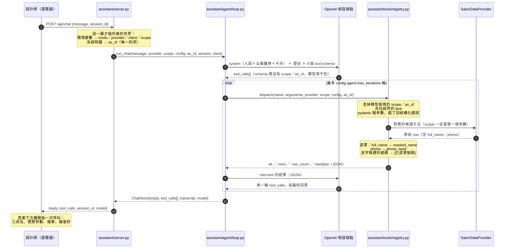
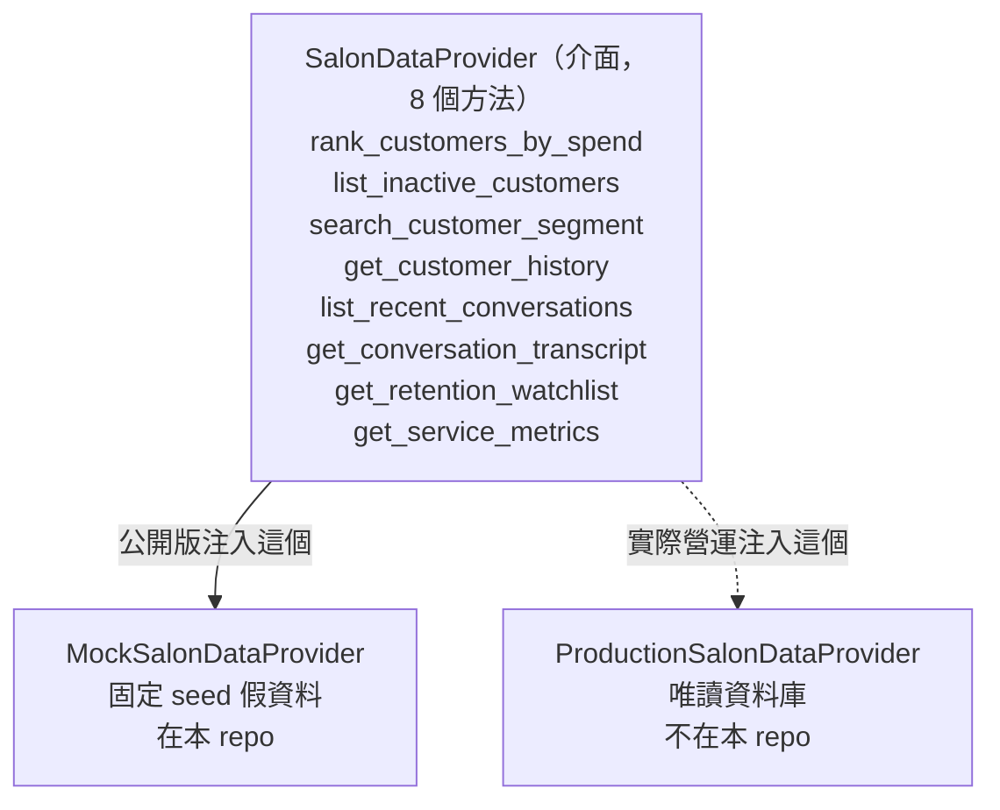

# 架構：一則問題從瀏覽器到答案

這份文件補 `README.md` 第 3 節那張圖沒講完的部分——**每一層負責什麼、
不負責什麼，以及界線畫在哪裡**。想直接跑起來看，回 `README.md` 第 4 節。

## 一句話

> 模型只做兩件事：決定叫哪個工具、把工具回的東西講成人話。
> 其餘全部是伺服器的事：注入授權與「現在」、驗參數、執行、遮罩、截斷、算上限。

所以「模型很爛」最多是**話講得不好**，不會變成「查到別人的客人」或「編出一位客人」。
這是我們敢把這一層公開的理由，也是整份設計唯一重要的決定。

## 一次問答的完整流程



撞到 `max_iterations` 不會再問模型一次，而是直接把「查到了什麼」講出來
（`TOO_MANY_ROUNDS_PREFIX`）。留白比硬掰好。

## 四道關卡：模型能碰到的東西一層比一層少

| 關卡 | 在哪 | 擋掉什麼 |
|---|---|---|
| ① schema | `tools/registry.py::tool_schemas` | `scope` 與 `as_of` **不在**模型看得到的參數表上 |
| ② 注入 | `dispatch()` 開頭 | 模型還是硬填了？進門前丟掉，改用伺服器給的值 |
| ③ 驗證與夾 | pydantic 輸入模型 | 封閉 enum、上下限；`limit: 999` 夾到邊界並回報 `clamped` |
| ④ 遮罩 | `_mask_row` / `_redact_text` | `full_name`／`phone` 不准離開這一層 |

再加一層在 provider 內部：`customer_ref`／`conversation_ref` 進來時
**一定再用 scope 查一次**。只有 UUID 不算授權——猜到別人的 UUID 也拿不到東西，
而且回的是「查不到」而不是「無權限」（後者等於承認那個識別碼存在）。

## 唯一的接縫：`SalonDataProvider`



八個方法，全部只讀，第一個參數一律是 `scope`。其中六個要求呼叫端傳 `as_of`
（`get_conversation_transcript` 問的是一個識別碼、`get_service_metrics` 問的是一段
明確的期間，兩者都不需要「今天」）。

第 9 個工具 `draft_follow_up_message` 不在這個介面上——它拿
`get_customer_history` 的結果去套設定裡的模板，**確定性**，連模型都不呼叫：
同一位客人跑一百次拿到同一段字。回訪訊息要能被設計師預期，不是每次換一種寫法。

**上面的每一層完全不知道下面是哪一個實作。** 公開版注入 Mock，實際營運那一份
注入唯讀 provider，agent 迴圈與工具程式碼一個字都不用改。
`assistant/server.py` 是唯一決定注入誰的地方，而且它切不過去時會 **400**，
不會安靜地退回示範資料卻把畫面上的徽章寫成 PRODUCTION。

## 「現在」只有一個入口

`assistant/` 底下**沒有任何一層讀系統時鐘**，唯一的例外是
`assistant/server.py::now()`。每一層的「今天」都是呼叫端傳進來的 `as_of`，
而且必須帶時區（不帶就 `ValueError`，不猜）。

為什麼要這麼硬：

- 示範模式把 `as_of` 釘在資料錨點 `2026-09-01T00:00:00+08:00`，
  影片、截圖、考卷答案、REPLAY 逐字稿四邊才對得起來。
- 接上唯讀連線之後，「最近 60 天沒回來」問的必須是**真的今天**。
- 時間得從某個地方進來——那就讓它只從一個**看得見的洞**進來，
  而不是散在十層裡各讀各的。

那個洞由一支 AST 掃描的測試守著（在私有 repo）：`datetime.now()` 只能出現在
`now()` 這個函式裡面，多一處就紅。

## REPLAY_MODE：工具重跑，最終文字沿用錄音

`assistant/agent/replay.py` 實作同一個 `ChatClient` Protocol，
所以迴圈完全不知道自己在回放：

```
一般模式： loop → HttpChatClient → OpenAI 相容端點
回放模式： loop → ReplayClient  → assistant/replay/*.json
```

錄音檔存的是**模型最終文字與它挑的工具呼叫**，不存工具結果。
工具會對 provider 重跑，工具卡摘要因此是本次結果；最終回答卻仍是固定錄音，
不會隨資料更新。這份錄音只適用於出貨的固定 seed／設計師／時間錨點。
更換資料或接真實唯讀 provider 必須設定 `REPLAY_MODE=0`，由即時模型整理結果。
模型文字也可能含客人資料，因此只准錄假資料，不能以「沒存工具結果」當成去識別保證。

比對的鍵是正規化後的問句（NFKC、去空白、casefold），
所以全形半形、有沒有空格都不影響。沒錄過的問題會誠實回一句
「這句話沒有錄音」，不會裝作答得出來。

## 前端

`assistant/frontend/` 是純靜態的 HTML／CSS／JS，沒有 build step、
沒有 npm install、沒有框架。`server.py` 把它掛在 `/`，
四個資料頁（預約、班表、客人、設定）預設讀套件內的 fixtures；
設了 `BACKOFFICE_API_BASE` 就改成轉發到既有後台的同一條路徑。

聊天頁把每一次工具呼叫攤在答案下面——**「這個數字哪來的」要看得見**，
這是設計師願意相信它的前提。

## 這個 repo 裡沒有的東西

| 不在這裡 | 為什麼 |
|---|---|
| `ProductionSalonDataProvider` | 連的是正在服務真實客人的資料庫 |
| 客人通道、POS 串接、登入、排程 | 賽前既有平台（見 README 揭露段） |
| 任何金鑰、端點網址、真實店名 | 設定檔只寫「去哪個環境變數拿」；匯出時整份掃過一次才准出門 |
| `local.yaml` | 實際營運者調過的參數；`.gitignore` 擋著 |

介面、schemas、九個工具、agent 迴圈、前端、示範資料產生器、
以及 201 個測試，全部在這裡。
